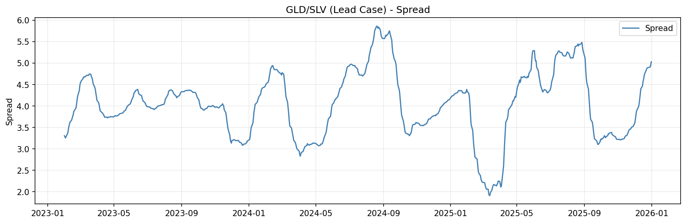
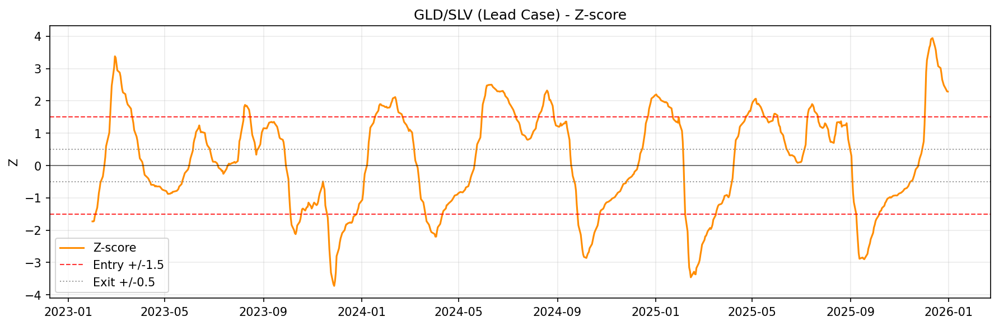
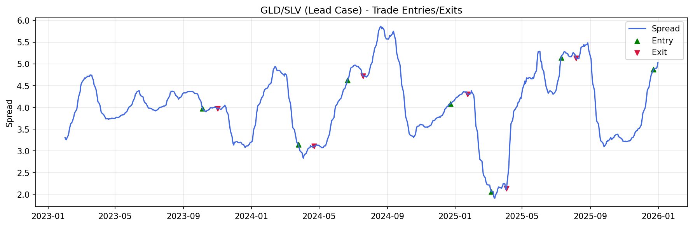
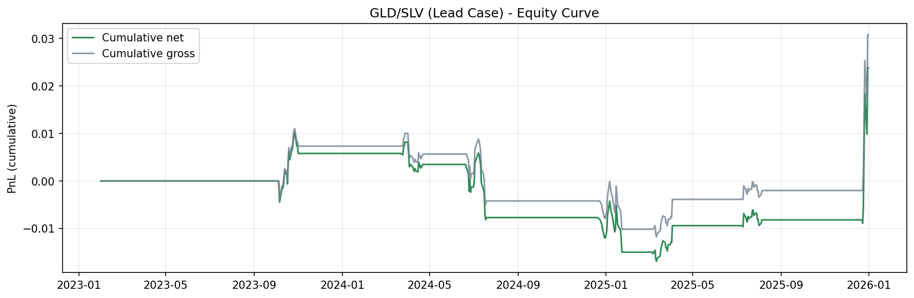
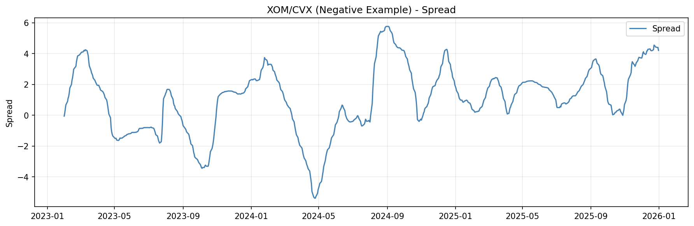
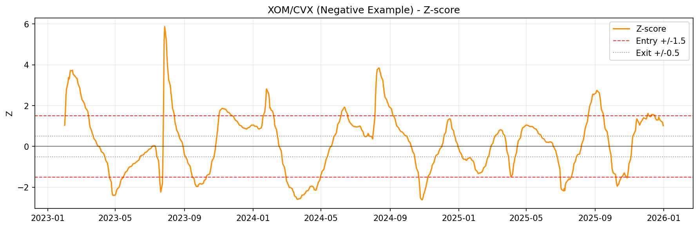
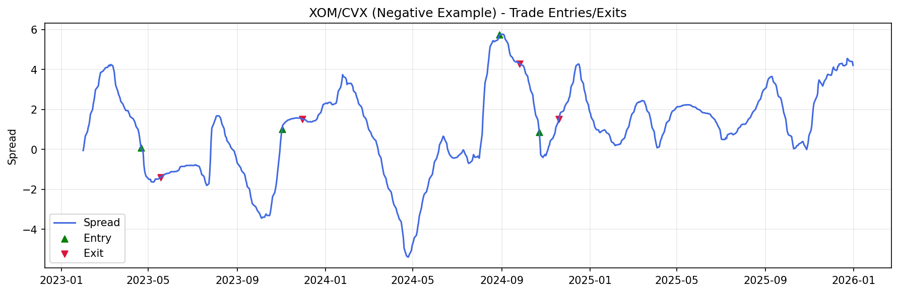
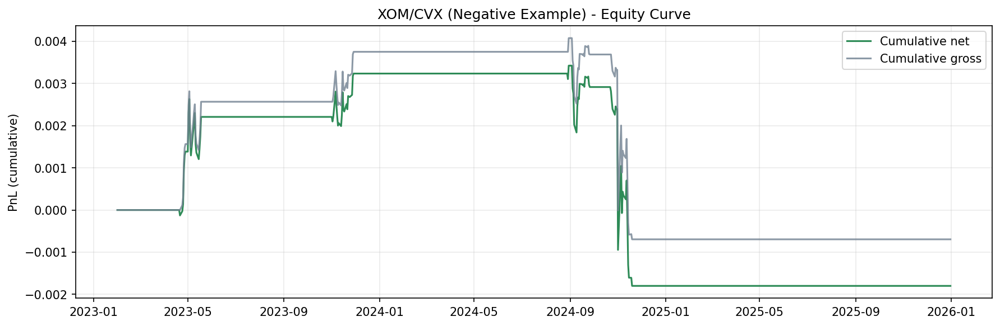
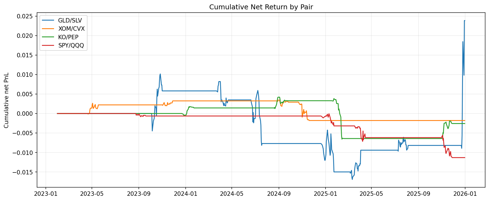
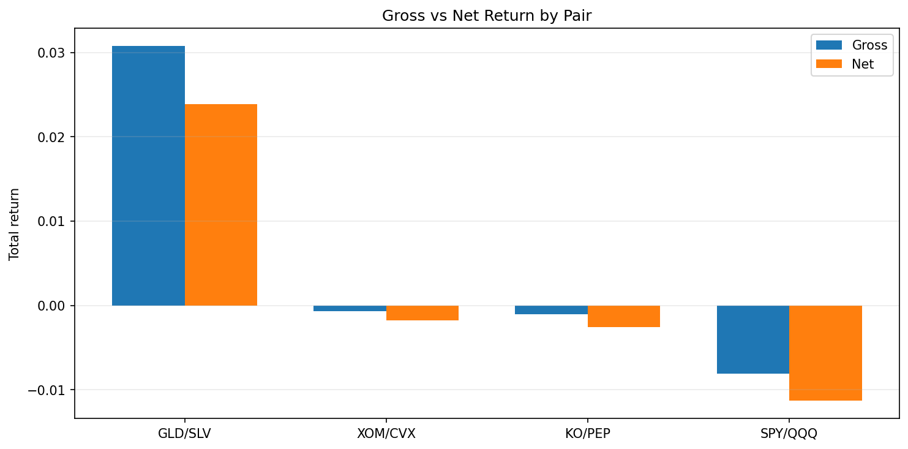

# Statistical Arbitrage on Equity Pairs

## Step 1 - Cointegration Testing

This project starts by pulling daily adjusted close prices from Yahoo Finance and
testing candidate pairs for cointegration using:

- Engle-Granger 2-step test
- Johansen trace and max-eigenvalue tests

**Correlation vs cointegration:** correlation is about co-movement of returns or
levels over a window; cointegration is about a *stable linear combination* of
price levels that is mean-reverting (I(0) spread) even when each price series is
non-stationary (I(1)). Pairs trading on spreads relies on cointegration (or a
close empirical analogue), not correlation alone.

Starter pairs:

- `GLD/SLV`
- `XOM/CVX`
- `KO/PEP`
- `SPY/QQQ`

### Run

```bash
python3 -m venv .venv
source .venv/bin/activate
pip install -r requirements.txt
python main.py
```

Defaults (dates, pairs) live in `config.py`. Engle-Granger and Johansen can
disagree depending on deterministic terms and VAR lag choices; see
`src/pair_selection.py` for the exact `statsmodels` calls.

Step 1 tests are run on **log prices** (not raw levels).

## Step 3 — Signal generation

Spread on logs: `spread_t = log(P1_t) - beta_t * log(P2_t)` with **rolling OLS**
`beta_t` on past data only. Signals use **z-score** of the spread, **rolling
Engle–Granger p-value** (cointegration stability), **rolling half-life**,
**rolling spread volatility** (for sizing), plus liquidity, correlation
stability, and spread slope (trend) gates. See `config.py` for thresholds.

**Entry:** `|z| > 2`, all entry gates true (including rolling cointegration
`p < DEFAULT_COINT_P_MAX`). **Short spread** when `z > 2`; **long spread** when
`z < -2`. **Exit:** `|z| < 0.5`, or `|z| > 3.5` (stop), or max holding period.
**Sizing:** continuous `min(|z|/Z_SIZE_REF, 1)` times volatility scaling toward
`TARGET_SPREAD_DAILY_VOL`, capped by `DEFAULT_MAX_CAPITAL_PER_PAIR` and
`DEFAULT_MAX_GROSS_LEVERAGE`. No new entry until the position is flat again.

```bash
python main.py step3              # first default pair
python main.py step3 GLD SLV      # explicit pair
```

## Step 4 — Backtest design

The backtest uses explicit time splits and walk-forward recalibration:

- Train / pair calibration: `2018-2021`
- Validation / tuning: `2022`
- Out-of-sample test: `2023-2025`

Walk-forward loop (monthly by default, configurable):

- Re-estimate hedge ratio
- Re-estimate OU parameters
- Retest cointegration stability (already embedded in step3 gating)
- Trade the next period only

Transaction costs are explicit and configurable in `config.py`:

- Per-leg trading cost in bps
- Per-leg slippage proxy in bps
- Turnover penalty in bps

Default assumption is `7 bps` trading + `3 bps` slippage + `1 bps` turnover
penalty, which is in the requested 5-10 bps per-leg range.

```bash
python main.py step4              # first default pair
python main.py step4 XOM CVX      # explicit pair
```

## Plot Reports

Generate all plots:

```bash
python main.py plots
```

Each run is archived in `reports/runs/<timestamp>/` and mirrored to
`reports/latest/` (latest run only).

### GLD/SLV Lead Case Study






### XOM/CVX Negative Example






### Pair Comparisons


